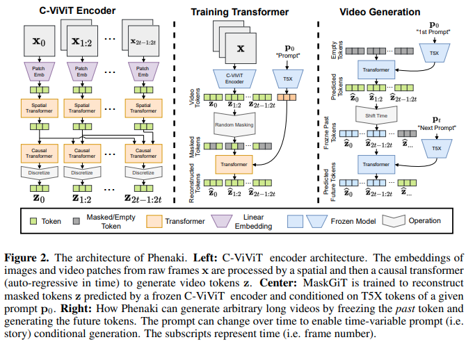

</img>

## <a href="https://en.wikipedia.org/wiki/Phenakistiscope">Phenaki</a> - Pytorch (wip)

Implementation of <a href="https://phenaki.video/">Phenaki Video</a>, which uses <a href="https://arxiv.org/abs/2202.04200">Mask GIT</a> to produce text guided videos of up to 2 minutes in length, in Pytorch. It will also combine another technique involving a <a href="https://arxiv.org/abs/2209.04439">token critic</a> for potentially even better generations

<a href="https://www.youtube.com/watch?v=RYLomvaPWa4">AI Coffeebreak explanation</a>

## Install

```bash
$ pip install phenaki-pytorch
```

## Usage

C-ViViT

```python
import torch
from phenaki_pytorch import CViViT

cvivit = CViViT(
    dim = 512,
    codebook_size = 5000,
    patch_size = 32,
    temporal_patch_size = 2,
    spatial_depth = 4,
    temporal_depth = 4,
    dim_head = 64,
    heads = 8
).cuda()

video = torch.randn(1, 3, 17, 256, 256).cuda() # (batch, channels, frames + 1 leading frame, image height, image width)

loss = cvivit(video)
loss.backward()
```

Phenaki

```python
import torch
from phenaki_pytorch import CViViT, MaskGit, Phenaki

maskgit = MaskGit(
    num_tokens = 5000,
    max_seq_len = 1024,
    dim = 512,
    dim_context = 768,
    depth = 6,
)

cvivit = CViViT(
    dim = 512,
    codebook_size = 5000,
    image_size = (256, 128),  # video with rectangular screen allowed
    patch_size = 32,
    temporal_patch_size = 2,
    spatial_depth = 4,
    temporal_depth = 4,
    dim_head = 64,
    heads = 8
)

phenaki = Phenaki(
    cvivit = cvivit,
    maskgit = maskgit
).cuda()

videos = torch.randn(3, 3, 17, 256, 128).cuda() # (batch, channels, frames, height, width)
mask = torch.ones((3, 17)).bool().cuda() # [optional] (batch, frames) - allows for co-training videos of different lengths as well as video and images in the same batch

texts = [
    'a whale breaching from afar',
    'young girl blowing out candles on her birthday cake',
    'fireworks with blue and green sparkles'
]

loss = phenaki(videos, texts = texts, video_frame_mask = mask)
loss.backward()

# do the above for many steps, then ...

video = phenaki.sample(text = 'a squirrel examines an acorn', num_frames = 17, cond_scale = 5.) # (1, 3, 17, 256, 128)

# so in the paper, they do not really achieve 2 minutes of coherent video
# at each new scene with new text conditioning, they condition on the previous K frames
# you can easily achieve this with this framework as so

video_prime = video[:, :, -3:] # (1, 3, 3, 256, 128) # say K = 3

video_next = phenaki.sample(text = 'a cat watches the squirrel from afar', prime_frames = video_prime, num_frames = 14) # (1, 3, 14, 256, 128)

# the total video

entire_video = torch.cat((video, video_next), dim = 2) # (1, 3, 17 + 14, 256, 128)

# and so on...
```

Or just import the `make_video` function

```python
# ... above code

from phenaki_pytorch import make_video

entire_video, scenes = make_video(phenaki, texts = [
    'a squirrel examines an acorn buried in the snow',
    'a cat watches the squirrel from a frosted window sill',
    'zoom out to show the entire living room, with the cat residing by the window sill'
], num_frames = (17, 14, 14), prime_lengths = (5, 5))

entire_video.shape # (1, 3, 17 + 14 + 14 = 45, 256, 256)

# scenes - List[Tensor[3]] - video segment of each scene
```

That's it!

## Token Critic

A <a href="https://arxiv.org/abs/2209.04439">new paper</a> suggests that instead of relying on the predicted probabilities of each token as a measure of confidence, one can train an extra critic to decide what to iteratively mask during sampling. You can optionally train this critic for potentially better generations as shown below

```python
import torch
from phenaki_pytorch import CViViT, MaskGit, TokenCritic, CriticTrainer

cvivit = CViViT(
    dim = 512,
    codebook_size = 5000,
    image_size = (256, 128),
    patch_size = 32,
    temporal_patch_size = 2,
    spatial_depth = 4,
    temporal_depth = 4,
    dim_head = 64,
    heads = 8
)

maskgit = MaskGit(
    num_tokens = 5000,
    max_seq_len = 1024,
    dim = 512,
    dim_context = 768,
    depth = 6,
)

critic = TokenCritic(
    num_tokens = 5000,
    max_seq_len = 1024,
    dim = 512,
    dim_context = 768,
    depth = 6
)

critic_trainer = CriticTrainer(
    maskgit = maskgit,
    critic = critic,
    cvivit = cvivit
).cuda()

texts = [
    'a whale breaching from afar',
    'young girl blowing out candles on her birthday cake',
    'fireworks with blue and green sparkles'
]

videos = torch.randn(3, 3, 3, 256, 128).cuda() # (batch, channels, frames, height, width)

loss = critic_trainer(videos = videos, texts = texts)
loss.backward()
```

Then just pass the critic to `Phenaki`

```python

phenaki = Phenaki(
    cvivit = cvivit,
    maskgit = maskgit,
    critic = critic
).cuda()

```

Now your generations should be greatly improved (but who knows, since this is only a month old research)

## Appreciation

- <a href="https://stability.ai/">Stability.ai</a> for the generous sponsorship to work on cutting edge artificial intelligence research

- <a href="https://huggingface.co/">🤗 Huggingface</a> for their amazing transformers and accelerate library

- <a href="https://github.com/gmegh">Guillem</a> for his ongoing contributions

- You? If you are a great machine learning engineer and / or researcher, feel free to contribute to the frontier of open source generative AI

## Todo

- [x] pass mask probability into maskgit and auto-mask and get cross entropy loss
- [x] cross attention + get t5 embeddings code from imagen-pytorch and get classifier free guidance wired up
- [x] wire up full vqgan-vae for c-vivit, just take what is in parti-pytorch already, but make sure to use a stylegan discriminator as said in paper
- [x] complete token critic training code
- [x] complete first pass of maskgit scheduled sampling + token critic (optionally without if researcher does not want to do extra training)
- [x] inference code that allows for sliding time + conditioning on K past frames
- [x] alibi pos bias for temporal attention
- [x] give spatial attention the most powerful positional bias
- [x] make sure to use stylegan-esque discriminator
- [x] 3d relative positional bias for maskgit
- [x] make sure maskgit can also support training of images, and make sure it works on local machine
- [x] also build option for token critic to be conditioned with the text
- [x] should be able to train for text to image generation first
- [x] make sure critic trainer can take in cvivit and automatically pass in video patch shape for relative positional bias - make sure critic also gets optimal relative positional bias
- [x] training code for cvivit
- [x] move cvivit into own file
- [x] unconditional generations (both video and images)

- [ ] add depthwise-convs to cvivit for position generating
- [ ] wire up accelerate for multi-gpu training for both c-vivit and maskgit
- [ ] some basic video manipulation code, allow for sampled tensor to be saved as gif
- [ ] add all top of the line research for stabilizing transformers training
- [ ] bring in concatenative token shift (temporal dimension)
- [ ] add a DDPM upsampler, either port from imagen-pytorch or just rewrite a simple version here
- [ ] outfit customizable self attention blocks to stylegan discriminator
- [ ] take care of masking in maskgit
- [ ] test maskgit + critic alone on oxford flowers dataset
- [ ] support rectangular sized videos
- [ ] add flash attention as an option for all transformers and cite @tridao
- [ ] abstract out text conditioning module into own package, and take care of audiolm-pytorch at the same time

## Citations

```bibtex
@article{Villegas2022PhenakiVL,
    title   = {Phenaki: Variable Length Video Generation From Open Domain Textual Description},
    author  = {Ruben Villegas and Mohammad Babaeizadeh and Pieter-Jan Kindermans and Hernan Moraldo and Han Zhang and Mohammad Taghi Saffar and Santiago Castro and Julius Kunze and D. Erhan},
    journal = {ArXiv},
    year    = {2022},
    volume  = {abs/2210.02399}
}
```

```bibtex
@article{Chang2022MaskGITMG,
    title   = {MaskGIT: Masked Generative Image Transformer},
    author  = {Huiwen Chang and Han Zhang and Lu Jiang and Ce Liu and William T. Freeman},
    journal = {2022 IEEE/CVF Conference on Computer Vision and Pattern Recognition (CVPR)},
    year    = {2022},
    pages   = {11305-11315}
}
```

```bibtex
@article{Lezama2022ImprovedMI,
    title   = {Improved Masked Image Generation with Token-Critic},
    author  = {Jos{\'e} Lezama and Huiwen Chang and Lu Jiang and Irfan Essa},
    journal = {ArXiv},
    year    = {2022},
    volume  = {abs/2209.04439}
}
```

```bibtex
@misc{ding2021cogview,
    title   = {CogView: Mastering Text-to-Image Generation via Transformers},
    author  = {Ming Ding and Zhuoyi Yang and Wenyi Hong and Wendi Zheng and Chang Zhou and Da Yin and Junyang Lin and Xu Zou and Zhou Shao and Hongxia Yang and Jie Tang},
    year    = {2021},
    eprint  = {2105.13290},
    archivePrefix = {arXiv},
    primaryClass = {cs.CV}
}
```

```bibtex
@misc{shazeer2020glu,
    title   = {GLU Variants Improve Transformer},
    author  = {Noam Shazeer},
    year    = {2020},
    url     = {https://arxiv.org/abs/2002.05202}
}
```

```bibtex
@misc{press2021ALiBi,
    title   = {Train Short, Test Long: Attention with Linear Biases Enable Input Length Extrapolation},
    author  = {Ofir Press and Noah A. Smith and Mike Lewis},
    year    = {2021},
    url     = {https://ofir.io/train_short_test_long.pdf}
}
```

```bibtex
@article{Liu2022SwinTV,
    title   = {Swin Transformer V2: Scaling Up Capacity and Resolution},
    author  = {Ze Liu and Han Hu and Yutong Lin and Zhuliang Yao and Zhenda Xie and Yixuan Wei and Jia Ning and Yue Cao and Zheng Zhang and Li Dong and Furu Wei and Baining Guo},
    journal = {2022 IEEE/CVF Conference on Computer Vision and Pattern Recognition (CVPR)},
    year    = {2022},
    pages   = {11999-12009}
}
```
